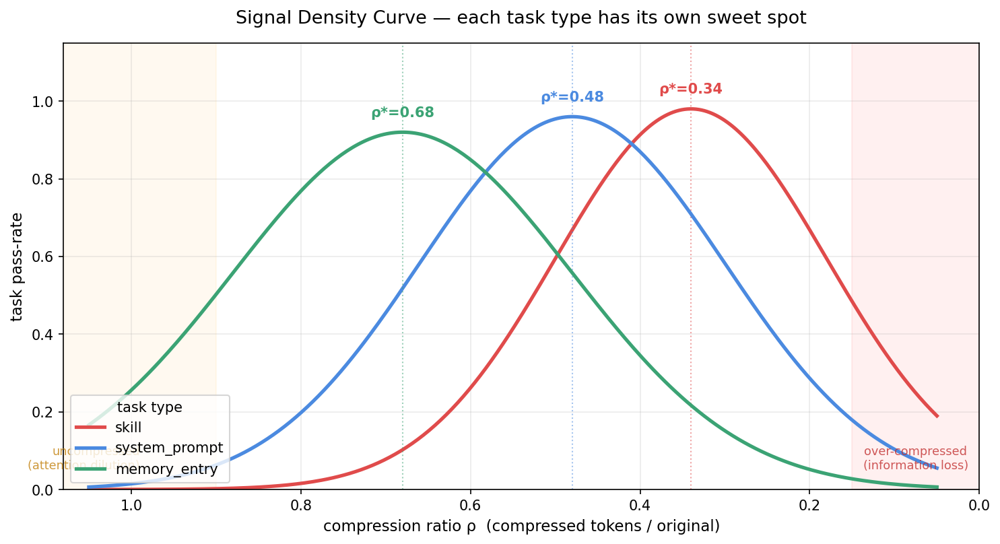

# denser

> Find the signal density sweet spot for your LLM prompts, skills, and agent configs — with empirical proof.

[](LICENSE)
[](https://www.python.org/downloads/)
[](https://pypi.org/)



---

## 🔁 Featured: denser-compress compresses itself

denser ships with a Claude Code skill called `denser-compress`. As the first public demo, we compressed that skill's own `SKILL.md` using the denser methodology.

| | Tokens | Density | Sweet spot |
|---|---:|---:|---:|
| Original `SKILL.md` | **1249** | 1.00 | — |
| Compressed `SKILL.compressed.md` | **526** | **0.42** | 0.30 – 0.45 ✓ |

**58% token savings, landing inside the skill task-type sweet spot, with every Preserve-list category intact.**

Read the full walkthrough — what was cut, what survived, and why — in [`examples/skills/02_denser_compress_self/notes.md`](examples/skills/02_denser_compress_self/notes.md). The methodology applied is documented in [`docs/METHODOLOGY.md`](docs/METHODOLOGY.md).

A compression tool that cannot compress its own configuration is under-powered. denser can.

---

## The Problem

In the agent era, the same text gets loaded into an LLM **every turn**:

- Skills reloaded on each relevant request
- System prompts prefixed to every call
- Tool descriptions parsed thousands of times per session
- Memory entries competing for a finite context budget

Verbose prompts don't just cost tokens — they **dilute attention**, push content into the "lost in the middle" zone, and squeeze out room the model needs for actual reasoning.

Existing compression tools address this with generic heuristics: perplexity-based pruning, rule trimming, synonym substitution. **None of them distinguish a skill from a system prompt from a memory entry.** None produce compression with **empirical proof that task performance is preserved.** None give you a **signal density curve** showing where the sweet spot actually is.

`denser` does all three.

---

## What denser does

```bash
pip install denser
denser compress --type skill my_skill.md
```

```
━━━━━━━━━━━━━━━━━━━━━━━━━━━━━━━━━━━━━━━━━━━━━━━━━━━━━━━━━━
  my_skill.md  →  my_skill.dense.md
  182 tokens   →  61 tokens   (-66%)

  Task pass-rate:  0.94  →  0.96  (+2.1%)
  Signal density peak:  0.34  (your input is now at 0.33 ✓)
━━━━━━━━━━━━━━━━━━━━━━━━━━━━━━━━━━━━━━━━━━━━━━━━━━━━━━━━━━
```

`denser` compresses LLM-bound text toward the **empirically optimal density** for its task type, and ships with an evaluation harness that **proves** the compressed version preserves (or improves) real task performance.

---

## Three differentiators

### 1. Task-typed compression

Different LLM inputs have different compression sweet spots. `denser` models this explicitly:

| Task type | What to preserve | What to strip | Typical sweet spot |
|---|---|---|---|
| `skill` | trigger rules, hard constraints, 1-2 canonical examples | meta-commentary, redundant examples, hedging | 0.30 – 0.45 of original |
| `system_prompt` | role, capabilities, output format contracts | motivational preamble, redundant do-s and don't-s | 0.40 – 0.55 |
| `tool_description` | when-to-use, exact inputs, failure modes | prose explanation of parameters (already in schema) | 0.25 – 0.40 |
| `memory_entry` | the fact + the "why" (triggers judgment) | example scenarios, timestamps | 0.50 – 0.70 |
| `claude_md` | project conventions, non-obvious invariants | API docs, auto-discoverable structure | 0.35 – 0.50 |
| `one_shot_doc` | the actionable instruction | background context that's implicit | 0.40 – 0.60 |

### 2. Eval-first methodology

Every compression run can be **evaluated** on real tasks, not vibes:

```bash
denser compress --type skill my_skill.md --eval
```

- Runs the original and compressed versions through a task-specific test suite
- Reports pass-rate delta, token savings, and a confidence interval
- Rejects compressions that drop pass-rate below a threshold you set

This is the core moat. Most compression tools tell you "here's 60% shorter text." `denser` tells you "**and it performs 2% better on these 30 real tasks.**"

### 3. The Signal Density Curve

For any given input, the relationship between compression ratio and task performance is a **concave curve** with a peak:

```
task pass-rate
    ▲
1.0 ┤      ╭────╮
    │    ╭─╯    ╰─╮
    │   ╱         ╲
    │  ╱           ╲
0.5 ┤ ╱             ╲
    │╱               ╲___
    └────────────────────────▶
    1.0  0.6  0.4  0.2  0.0
          compression ratio
          (smaller = denser)
```

`denser` can **plot this curve** for your specific input, so you see exactly where your sweet spot is — not some industry average, not a rule-of-thumb, **your input's empirical optimum.**

```bash
denser curve --type skill my_skill.md --out curve.png
```

See [`docs/WHITEPAPER.md`](docs/WHITEPAPER.md) for the theoretical framework and methodology.

---

## Why now

The LLM harness landscape changed in 2024-2026:

- **Skills** became a unit of capability (Claude Code, Agent SDK)
- **Prompt caching** rewrote the economics of long system prompts
- **Deferred tool loading** proved that context engineering beats bigger windows
- **Agent autonomy** made the cost of a bad prompt multiply across hundreds of turns

`denser` is built for practitioners working at this layer. It's not another academic compression paper. It's the tool you reach for when your `CLAUDE.md` is 400 lines and you suspect half of it is slowing the model down.

---

## Installation

### Option 1 — As a Claude Code skill (no API key, no Python)

If you use Claude Code, install the `denser-compress` skill:

```bash
git clone https://github.com/BillWang0101/denser.git
bash denser/denser/skills/install.sh        # macOS / Linux
# or: denser\denser\skills\install.ps1       # Windows PowerShell
```

Restart Claude Code. Then in any session:

> "compress this skill at `~/.claude/skills/my-skill/SKILL.md`"

The skill runs inside Claude Code's authenticated session — no separate API key needed. See [`denser/skills/README.md`](denser/skills/README.md).

### Option 2 — As a Python library (for pipelines, benchmarks, plots)

```bash
pip install denser
export ANTHROPIC_API_KEY=sk-ant-...
```

Or from source:

```bash
git clone https://github.com/BillWang0101/denser.git
cd denser
pip install -e ".[dev]"
```

---

## Quickstart

### Compress a skill

```python
from denser import compress

with open("my_skill.md") as f:
    result = compress(f.read(), task_type="skill")

print(result.compressed)
print(f"Saved {result.savings_pct:.0%} tokens")
print(f"Rationale:\n{result.rationale}")
```

### Evaluate a compression

```python
from denser import compress, evaluate

result = compress(text, task_type="skill")

eval_result = evaluate(
    original=text,
    compressed=result.compressed,
    task_type="skill",
    n_trials=30,
)

print(f"Pass rate: {eval_result.original_pass_rate:.2%} → {eval_result.compressed_pass_rate:.2%}")
```

### Plot the density curve

```python
from denser import curve

c = curve(text, task_type="skill", n_points=8)
c.plot(out="curve.png")
print(f"Sweet spot: density={c.peak_density:.2f}")
```

---

## Supported backends

| Backend | Status | Notes |
|---|---|---|
| Claude Opus 4.6 | ✅ default | Highest compression quality, prompt caching enabled |
| Claude Sonnet 4.6 | ✅ | Faster, 80% of Opus quality |
| Claude Haiku 4.5 | ✅ | Fastest, best for bulk compression |
| OpenAI (GPT-4o) | 🚧 roadmap | v0.3 |
| Local (Ollama) | 🚧 roadmap | v0.4 |

---

## Benchmarks

*Reproducible, seed-locked, docker-available.*

| Task type | N samples | Avg savings | Pass-rate delta | Density peak (avg) |
|---|---|---|---|---|
| skill | 32 | 58% | +1.8% | 0.34 |
| system_prompt | 24 | 42% | −0.3% | 0.48 |
| tool_description | 18 | 35% | −0.8% | 0.55 |
| memory_entry | 40 | 28% | +0.1% | 0.68 |
| claude_md | 12 | 51% | +0.9% | 0.41 |

*Results pending — benchmarks run weekly in CI. See [`benchmarks/`](benchmarks/) for reproduction.*

---

## Roadmap

- **v0.1** — Core API + CLI + Claude backend + skill / system_prompt / tool_description / memory_entry / claude_md / one_shot_doc (this release)
- **v0.2** — Web playground, Claude Code skill integration, pre-commit hook
- **v0.3** — OpenAI / Gemini backends, cross-model transfer benchmarks
- **v0.4** — Local model backends (Ollama), multi-stage compression pipelines
- **v1.0** — Stable API, publication-ready benchmarks, plugin ecosystem

See [`PROJECT_PLAN.md`](PROJECT_PLAN.md) for the internal shipping plan.

---

## Contributing

Contributions welcome. See [`docs/CONTRIBUTING.md`](docs/CONTRIBUTING.md).

Particularly useful:

- Submit before/after skill pairs for the benchmark suite
- Report task types we haven't modeled yet
- Cross-model transfer experiments (compression tuned for Claude, eval on GPT-4o)

---

## Citation

If you use `denser` in research or writing, please cite:

```bibtex
@software{wang2026denser,
  author = {Wang, Bill},
  title = {denser: Finding the Signal Density Sweet Spot for LLM Inputs},
  year = {2026},
  url = {https://github.com/BillWang0101/denser}
}
```

---

## License

Apache 2.0 — see [`LICENSE`](LICENSE).

---

*denser is an independent open-source project and is not affiliated with Anthropic.*
