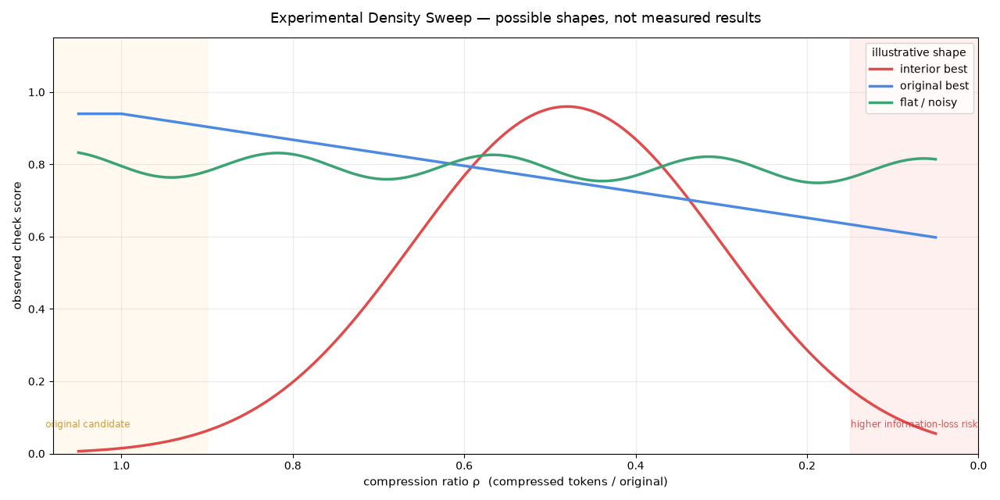

# denser

> Prove which LLM context can be removed or rewritten without changing required behavior.

[](LICENSE)
[](https://www.python.org/downloads/)
[](https://github.com/Evostructs/denser/actions/workflows/ci.yml)




> [!IMPORTANT]
> denser is an alpha research prototype. It does not replace a model provider's
> runtime compaction. It audits a baseline and a proposed context variant against
> asset-specific behavior cases, and requires a known-bad negative control before
> reporting observed preservation. Evidence applies only to the exact workload,
> execution model, and runtime configuration used.
> See [`docs/DESIGN.md`](docs/DESIGN.md) for the evidence standard and the active
> implementation plan.

---

## Featured: measurable Codex input reduction for text-only tasks

The first result that clears denser's end-to-end bar comes from capability
selection, not prose compression. For replay tasks that need no files, shell,
network, plugins, apps, skills, or memory, the Codex CLI adapter can use an
explicit `text-only` profile and omit those unused capabilities from the model
input. `standard` remains the default.

With Codex CLI 0.147.0, `gpt-5.6-sol`, and medium reasoning:

| Workload | Quality | Full input per call | Reduction |
|---|---:|---:|---:|
| Release-operation decisions | 27/27 in each profile | 20,294.11 → 18,154.00 | 10.55% |
| Automation permission routing | 15/15 in each profile | 20,619.00 → 18,434.00 | 10.60% |

This clears the predeclared rule of at least two real scenarios with at least
10% provider-reported full-input reduction and no observed quality loss. The
final run made 84 authenticated calls in seeded randomized order, with three
trials per case, zero operational errors, and zero transport fallbacks. It is
not a general coding mode: tasks that need tools must use `standard`.

The first strict run caught one regression: without tools, one case asked for
more context instead of following its fixed output contract. The `text-only/v1`
wrapper now states that all required input is already present, and the complete
84-call audit was rerun rather than patching the single failure. This is the
kind of false confidence denser is designed to expose.

The earlier 10.3%-shorter instruction rewrite reduced full Codex input by only
about 0.25%. That negative result remains important: rewriting a small file is
not enough when the larger cost is unused runtime context.

See the [case study and reproduction
guide](docs/CODEX_TEXT_ONLY_CASE_STUDY.md), plus the complete per-call outputs,
token counts, source hashes, runtime settings, and limitations in the
[`paired three-trial audit`](examples/project_instructions/codex-text-only-profile-audit.paired-3x-final.2026-08-17.json).

### Public-project transfer check: Astral uv

The same frozen profile was then tested against decision rules adapted from
public Astral uv agent prompts at commit
[`5cc226096`](https://github.com/astral-sh/uv/tree/5cc226096ea4424d021be17259bae51d761a827b).
The 14 cases were committed before execution, then run three times per profile:

| Workload | Quality | Full input per call | Reduction |
|---|---:|---:|---:|
| uv issue-triage decisions | 24/24 in each profile | 20,335.25 -> 18,200.75 | 10.50% |
| uv workflow-failure decisions | 18/18 in each profile | 20,345.83 -> 18,160.83 | 10.74% |

All 84 calls completed with zero operational errors and zero transport
fallbacks. This is an external-project corpus run by denser's maintainers, not
an independent reproduction or an endorsement by Astral. See the
[frozen corpus and boundaries](examples/project_instructions/03_uv_public_pilot/README.md)
and the [complete per-call report](examples/project_instructions/03_uv_public_pilot/codex-profile-audit.paired-3x.2026-08-18.json).

---

## The problem

In the agent era, the same text gets loaded into an LLM **every turn**:

- Skills reloaded on each relevant request
- System prompts prefixed to every call
- Tool descriptions parsed thousands of times per session
- Memory entries competing for a finite context budget

Codex and other agent runtimes can already compact growing conversation history.
That solves a capacity problem, but it does not prove which requirements,
permissions, decisions, or unfinished work survived a context change. For Codex,
automatic history compaction is an explicit runtime feature with a configurable
threshold; see the
[official configuration reference](https://learn.chatgpt.com/docs/config-file/config-reference).

denser focuses on the missing evidence layer: compare a baseline with a rewritten,
selectively loaded, or externally compacted text snapshot; replay realistic
behavior cases; verify that a known-bad control is caught; and report actual
end-to-end input usage separately from asset-only length.

---

## What denser does

```bash
denser audit AGENTS.md AGENTS.variant.md --type claude_md \
  --suite replay.holdout.json \
  --negative-control AGENTS.negative-control.md \
  --backend codex-cli --model gpt-5.6-sol --n-trials 3

denser inspect --type skill my_skill.md
denser optimize --type skill my_skill.md \
  --out my_skill.optimized.md \
  --evidence-out my_skill.evidence.json
denser compress --type skill my_skill.md
denser verify --type skill my_skill.md my_skill.dense.md
denser replay --type claude_md AGENTS.md --suite replay.json \
  --compare-to AGENTS.variant.md --backend codex-cli

# Only for tasks that need no tools, files, network, plugins, skills, or memory
denser replay --type claude_md AGENTS.md --suite replay.json \
  --backend codex-cli --codex-capability-profile text-only
```

`audit` is the primary interface. It runs paired baseline/variant replay,
compares every covered case, checks whether a known-bad negative control causes
a regression, and reports both asset-only estimates and provider-reported full
input usage. Equal scores without a detected negative control are
`inconclusive`, not proof of preservation.

`inspect` performs an offline scan and produces a source-linked
preservation contract: triggers, exclusions, hard constraints, safety and
permission rules, output obligations, failure paths, and protected literals.
It makes no model or network calls. `optimize` gives the contract to the
generator, samples multiple candidates, verifies each one, and recommends the
shortest passing option; the original always remains a candidate. It never
overwrites the source or an existing output file. `verify` rejects missing
metadata and protected literals, and leaves changed obligations at `review`
until they have deterministic or explicitly mapped behavior evidence.
`replay` is the lower-level runner. It executes realistic requests with the instruction asset in the backend's
system-instruction position, scores outputs with deterministic rules, and
randomizes paired original/candidate call order. The CLI reports each completed
call with total progress, asset side, case, and trial; use `--no-progress` for
quiet runs. `compress`, `optimize`, `eval`, and `curve` remain candidate-generation
or research tools. A shorter candidate is not a result until `audit` can produce
sensitive behavior evidence for it.

---

## Three differentiators

### 1. Sensitivity before certification

A baseline and variant can receive identical scores because they behave the
same, or because the workload is too weak to notice the difference. `audit`
requires a known-bad negative control to regress before it returns
`preserved`. Without that control, the result remains `inconclusive`.

### 2. Deterministic, reproducible behavior replay

Replay suites exercise real triggers, near misses, permission boundaries,
failure paths, and adversarial requests. Outputs are checked with explicit
exact, contains, or regular-expression rules; operational errors remain
separate from content failures. Paired baseline/variant calls use a recorded,
randomized order.

### 3. Honest end-to-end measurement

Reports keep two denominators separate:

- local asset estimates show how much the edited file changed;
- provider-reported input totals show what changed across the complete run.

This prevents a 10% file reduction from being presented as a 10% runtime or
cost reduction when the edited file is only a small part of the full context.

## Optional candidate generation

### Role-aware rewriting

Different instruction assets have different failure modes. denser currently
ships six rewrite profiles. Their density ranges are exploratory generation
defaults, not measured optima:

| Task type | What to preserve | What to strip | Exploratory target |
|---|---|---|---|
| `skill` | trigger rules, hard constraints, 1-2 canonical examples | meta-commentary, redundant examples, hedging | 0.30 – 0.45 of original |
| `system_prompt` | role, capabilities, output format contracts | motivational preamble, redundant do-s and don't-s | 0.40 – 0.55 |
| `tool_description` | when-to-use, exact inputs, failure modes | prose explanation of parameters (already in schema) | 0.45 – 0.60 |
| `memory_entry` | the fact + the "why" (triggers judgment) | example scenarios, timestamps | 0.58 – 0.78 |
| `claude_md` | project conventions, non-obvious invariants | API docs, auto-discoverable structure | 0.35 – 0.50 |
| `one_shot_doc` | the actionable instruction | background context that's implicit | 0.40 – 0.60 |

### Structural checks and lower-level replay

Compare an original and candidate with a deterministic suite written for that
asset:

```bash
denser replay --type claude_md AGENTS.md --suite replay.json \
  --compare-to AGENTS.dense.md --backend codex-cli \
  --model gpt-5.6-sol --codex-reasoning-effort medium \
  --n-trials 3 --seed 20260817
```

- Built-in fixtures check for structural signals such as an explicit trigger or
  hard constraint.
- Replay suites exercise real triggers, near misses, permission boundaries,
  failure paths, and adversarial requests against the execution backend.
- Outputs are checked with exact, contains, or regular-expression rules; model
  and service errors remain separate from content failures.
- The Codex CLI adapter uses an independent authenticated CLI, an ephemeral
  read-only turn, and records sanitized per-call status, latency, and token
  usage without copying local authentication or raw diagnostics into reports.
- Its optional `text-only` capability profile removes unused tool and extension
  context for pre-bundled text tasks. It is not a substitute for `standard`
  when the workload needs files, commands, network access, plugins, apps,
  skills, or memory.
- Replay report `v3` introduced a sanitized top-level runtime configuration:
  backend kind, model, Codex CLI version, reasoning effort, timeout, isolation
  flags, system-proxy choice, and disabled features. Executable paths, account
  details, credentials, thread identifiers, and raw diagnostics are excluded.
- Holdout suite `v2` binds the source and candidate hashes to a candidate-freeze
  commit. Replay report `v4` carries that freeze and the non-sensitive authoring
  record, and refuses changed assets before making a model call.
- Reports show observed pass rates. They do not yet compute a
  confidence interval or automatically establish behavioral equivalence.

See the synthetic redistributable
[`AGENTS.md` release-operations case](examples/project_instructions/01_codex_release_ops/README.md)
and the licensed upstream
[`openai-python` policy case](examples/project_instructions/02_openai_python_version_policy/README.md)
for complete sources, candidates, five-category workloads, provenance, and
reproduction commands. The second case freezes its candidate before an
independent process authors the holdout.

Replay JSON contains raw model outputs. Store it with the same access controls
as the instruction asset and workload prompts.

### Experimental density sweep

`denser curve` samples candidates at several target densities and plots the
observed scores. The relationship is not assumed to be concave: it may be
monotone, flat, noisy, multi-peaked, or favor the original.

```
task pass-rate
    ▲
1.0 ┤      ╭────╮
    │    ╭─╯    ╰─╮
    │   ╱         ╲
    │  ╱           ╲
0.5 ┤ ╱             ╲
    │╱               ╲___
    └────────────────────────▶
    1.0  0.6  0.4  0.2  0.0
          compression ratio
          (smaller = denser)
```

The current implementation also draws an optional quadratic fit. Treat it as a
visual aid, not proof of an optimum.

```bash
denser curve --type skill my_skill.md --out curve.png
```

See [`docs/DESIGN.md`](docs/DESIGN.md) for the active evidence standard and
[`docs/WHITEPAPER.md`](docs/WHITEPAPER.md) for the original research hypothesis.

---

## Why reviewable context snapshots

Skills, system/developer instructions, tool descriptions, project rules, and
memory policies are reused and often version controlled. Exported before/after
history summaries can also become reviewable snapshots. These artifacts make
behavior changes reproducible in a way that an opaque runtime event is not.

---

## Installation

denser can be used as a regular CLI/library with any agent, or as an interactive
skill inside Codex or Claude Code.

### Option 1 — CLI and Python library (agent-independent)

```bash
git clone https://github.com/Evostructs/denser.git
cd denser
python -m pip install .
denser --version
```

This is the general installation for scripts, CI, benchmarks, and Python use.
Commands that call a model still need the corresponding provider or authenticated
CLI; deterministic inspection commands do not.

### Option 2 — OpenAI Codex skill (no separate API key or Python)

If Codex is not installed, the official cross-platform npm option is:

```bash
npm install -g @openai/codex
codex
```

On first launch, choose **Sign in with ChatGPT** or another available sign-in
method. See the [official Codex CLI installation
guide](https://learn.chatgpt.com/docs/codex/cli).

Then ask Codex to install denser from this repository:

> `$skill-installer install the denser-compress skill from https://github.com/Evostructs/denser/tree/main/denser/skills/denser-compress`

Invoke it with `$denser-compress`, or describe a matching compression task.
Codex uses its existing authenticated session; denser needs no separate API key.

### Option 3 — Claude Code skill (no separate API key or Python)

If you use Claude Code, install the `denser-compress` skill:

```bash
git clone https://github.com/Evostructs/denser.git
bash denser/denser/skills/install.sh        # macOS / Linux
# or: denser\denser\skills\install.ps1       # Windows PowerShell
```

Restart Claude Code. Then in any session:

> "compress this skill at `~/.claude/skills/my-skill/SKILL.md`"

The skill runs inside Claude Code's authenticated session. For manual Codex and
Claude Code installation, verification, and removal, see
[`denser/skills/README.md`](denser/skills/README.md).

---

## Quickstart

### Audit a context variant

```python
from denser import audit_context, load_replay_suite

suite = load_replay_suite("replay.holdout.json")
report = audit_context(
    baseline=baseline_text,
    variant=variant_text,
    negative_control=known_bad_text,
    task_type="claude_md",
    tasks=suite,
    backend=execution_backend,
    n_trials=3,
    seed=20260817,
)

print(report.decision.value)
print(report.observed_input_reduction_pct)
```

`preserved` means the variant matched every covered baseline case and the same
suite caught the known-bad control. `regressed` means the variant lost covered
behavior. Improvements are sent to `review`; missing or insensitive controls
and operational failures are `inconclusive`.

### Inspect and verify offline

```python
from denser import inspect, verify
from pathlib import Path

original = Path("my_skill.md").read_text(encoding="utf-8")
candidate = Path("my_skill.dense.md").read_text(encoding="utf-8")

contract = inspect(original, task_type="skill")
report = verify(
    original,
    candidate,
    task_type="skill",
    inspection=contract,
)

print(report.decision.value)
print(report.missing_literals)
```

The offline verifier exits `0` for `pass`, `3` for `review`, and `2` for
`reject`. A changed semantic obligation remains at `review` unless it is
retained verbatim or covered by an explicitly mapped behavior task. Custom
`GoldenTask` objects map evidence with `covers=("C003", ...)`; service errors
are reported separately and never count as successful behavior evidence.

For deterministic execution rather than judge-based scoring, load a replay
suite and pass it to `verify` with the same backend that will execute the asset:

```python
from denser import load_replay_tasks, verify

suite = load_replay_tasks("replay.json")
report = verify(
    original,
    candidate,
    task_type="claude_md",
    replay_tasks=suite,
    execution_backend=my_backend,
    replay_seed=20260817,
)
```

### Optimize with multiple candidates

```python
from denser import optimize

report = optimize(
    original,
    task_type="skill",
    target_densities=(0.30, 0.40, 0.50),
    source_name="my_skill.md",
)

print(report.recommended_candidate_id)
print(report.recommendation_reason)
print(report.recommended.text)
```

The returned report uses the versioned
`denser.optimization-report/v1` schema and records source hash, candidates,
contract coverage, model identifiers, logical model calls, operational errors,
token-counting method, and timing. The default counter is the explicitly
approximate offline `heuristic-v1`. For provider-aware Anthropic counts, pass
`token_counter=AnthropicTokenCounter(model="...")`; it raises on failure rather
than silently substituting an estimate. CLI evidence JSON includes source and
candidate text; keep it with the same access controls as the instruction asset.
Without mapped behavior tasks, semantic rewrites remain at `review`, so a
conservative run may correctly recommend the original.

### Compress a skill

```python
from denser import compress

with open("my_skill.md") as f:
    result = compress(f.read(), task_type="skill")

print(result.compressed)
print(f"Saved {result.savings_pct:.0%} tokens")
print(f"Rationale:\n{result.rationale}")
```

### Evaluate a compression

```python
from denser import compare, compress
from pathlib import Path

text = Path("my_skill.md").read_text(encoding="utf-8")
result = compress(text, task_type="skill")

report = compare(
    original=text,
    compressed=result.compressed,
    task_type="skill",
    n_trials=3,
)

print(
    f"Observed structural-check pass rate: "
    f"{report.original.overall_pass_rate:.2%} → "
    f"{report.compressed.overall_pass_rate:.2%}"
)
```

### Plot the density curve

```python
from denser import curve

c = curve(text, task_type="skill", densities=(0.3, 0.5, 0.7, 1.0))
c.plot(out="curve.png")
print(f"Best observed/fitted density: {c.peak_density:.2f}")
```

---

## Supported backends

denser ships three generation backends and one replay-only local CLI adapter:

```python
from denser.backends import (
    ClaudeBackend,
    CodexCliBackend,
    OpenAICompatibleBackend,
    SiliconFlowBackend,
)

# Anthropic adapter used by the current default
ClaudeBackend(model="claude-opus-4-6")

# SiliconFlow preset for its OpenAI-compatible endpoint
SiliconFlowBackend(model="zai-org/GLM-4.6")

# Generic Chat Completions-compatible endpoint
OpenAICompatibleBackend(base_url="https://api.openai.com/v1", model="gpt-4o")

# Authenticated local Codex CLI; available to `denser audit` and `denser replay`
CodexCliBackend(model="gpt-5.6-sol", reasoning_effort="medium")
```

On Windows, install the official `@openai/codex` package independently. The
adapter discovers `%APPDATA%\\npm\\codex.cmd`, accepts `DENSER_CODEX_CLI` or
`--codex-cli-path`, and deliberately rejects the desktop app's private
WindowsApps executable.

### Which backend to use

Backend quality is asset- and workload-dependent. The observations in
[`docs/CROSS_MODEL_NOTES.md`](docs/CROSS_MODEL_NOTES.md) come from one source
asset with one generation per model plus a separate repeated behavior-replay
follow-up on two project-instruction cases. They are useful for reproducing
prompt-following differences, but they do not support general model rankings.
Validate the candidate on the model that will execute the instruction.

For replay providers whose reasoning tokens share the output allowance, use
`--openai-thinking-mode disabled` for short exact-label tasks when the provider
supports the compatible `thinking` field. The default remains
`provider-default`; denser does not silently change provider behavior.

---

## Benchmarks

No general context-optimization benchmark is published yet. The repository
currently contains ten before/after examples, including two `AGENTS.md` cases.
The second uses a candidate-frozen, chronologically blind holdout and material
negative controls, but the public examples as a whole are not an independent
evaluation dataset.

The runner in [`benchmarks/`](benchmarks/) can execute the current corpus with a
live backend. Results are publishable only when raw output, model/settings,
asset-specific behavior tasks, provenance, and a reproduction command are
committed together.

---

## Integrations

### Pre-commit hook

Add an advisory size review for LLM-input files (skills, `CLAUDE.md`, system
prompts, memory entries) with a single copy:

```bash
cp integrations/pre-commit-hook.sh .git/hooks/pre-commit
chmod +x .git/hooks/pre-commit
```

The hook uses a local estimate, makes no API call, and never blocks a commit on
length alone. The reference sizes are review prompts, not quality thresholds.
See [`integrations/README.md`](integrations/README.md).

### Agent skill

The portable `denser-compress` skill works in both OpenAI Codex and Claude Code
without a separate provider API key. See
[`denser/skills/README.md`](denser/skills/README.md) for tool-specific install
commands.

---

## Roadmap

- **Phase 0** — align claims, terminology, integrations, and metadata with the committed evidence
- **Phase 1** — preservation contract, source mapping, multi-candidate optimization, and evidence report
- **Phase 2** — deterministic replay and one candidate-frozen holdout are available; broader external workloads remain
- **Phase 3** — context audit with negative-control sensitivity and honest end-to-end token measurement is available
- **Phase 4** — audit real selective-loading and runtime-compaction snapshots across long-horizon tasks
- **Phase 5** — external pilot projects, reproducible releases, and evaluation adapters

See [`docs/DESIGN.md`](docs/DESIGN.md) for scope, evidence rules, and delivery
gates. [`PROJECT_PLAN.md`](PROJECT_PLAN.md) is retained as the historical launch
plan.

---

## Contributing

Contributions welcome. See [`docs/CONTRIBUTING.md`](docs/CONTRIBUTING.md).

Particularly useful:

- Submit a realistic instruction asset with provenance and redistribution terms
- Add positive, negative, exceptional, or adversarial behavior cases
- Add a known-bad negative control that proves a replay suite is sensitive
- Capture a reproducible before/after context snapshot across runtime compaction
- Report a candidate that passed a structural check but failed in real use
- Reproduce an observation with committed model settings and raw results

---

## Acknowledgements

- **Bill Wang ([@Evostructs](https://github.com/Evostructs))** — project creator
  and maintainer.
- [OpenAI Codex](https://openai.com/codex/) — development and validation support
  for this release.
- [Claude](https://claude.com/product/overview) — development support for
  earlier releases.

---

## Citation

If you use `denser` in research or writing, please cite:

```bibtex
@software{wang2026denser,
  author = {Wang, Bill},
  title = {denser: Behavior-Fidelity Audits for Version-Controlled LLM Context},
  year = {2026},
  url = {https://github.com/Evostructs/denser}
}
```

---

## License

Apache 2.0 — see [`LICENSE`](LICENSE). Redistributed upstream material and
modification notices are listed in [`THIRD_PARTY_NOTICES.md`](THIRD_PARTY_NOTICES.md).

---

*denser is an independent open-source project and is not affiliated with
Anthropic or OpenAI.*
